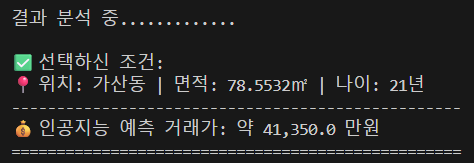
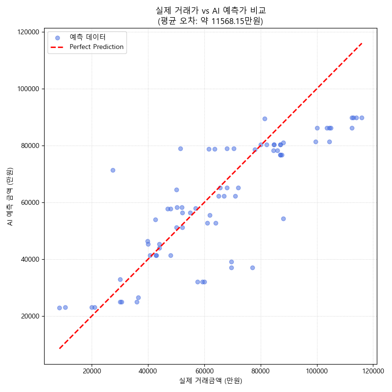
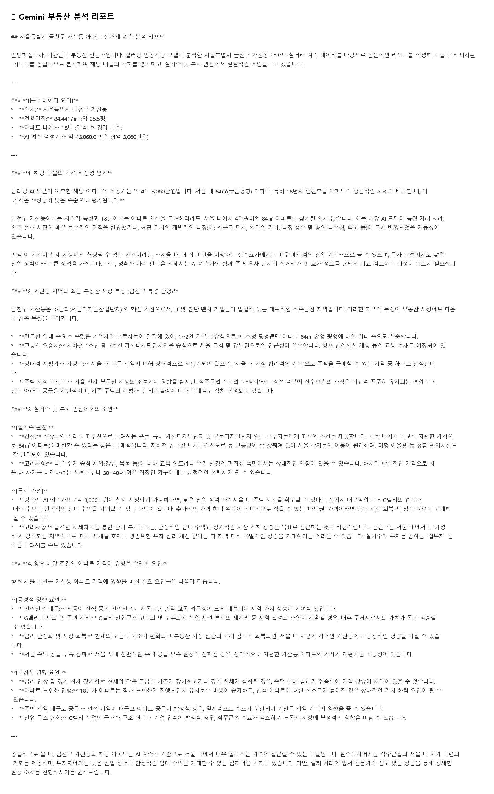

# 🏠 우리 집 근처 부동산 가격 예측 프로젝트

이 프로젝트는 텐서플로와 제미나이를 활용하여 실거래가를 예측하고 분석합니다.

## 🚀 프로젝트 주요 단계 및 기술 스택

### 1. 환경 설정 및 데이터 수집
* **주요 작업**: 라이브러리 설치 및 공공데이터 API 연동 (금천구 2024년 6개월치 데이터 확보)
* **보안 관리**: API 키 노출 방지를 위해 `.env` 파일과 `.gitignore` 활용
* **Technical Stack**: `Python`, `Requests`, `python-dotenv`

---

### 2. 데이터 전처리 및 시각화 (EDA)
* **주요 작업**: 거래금액 정수형 변환, 결측치 제거, '아파트 나이' 변수 생성 및 상관관계 분석
* **Technical Stack**: `Pandas`, `Matplotlib`, `Seaborn`

#### 📊 시각화 분석 결과
| 동네별 평균 거래가 | 전용면적과 거래금액의 상관관계 | 아파트 나이에 따른 가격 분포 |
| :---: | :---: | :---: |
|  |  |  |

> **💡 EDA를 진행하는 이유와 분석의 의미**
> * **데이터의 경향성 파악**: 딥러닝 모델 학습 전, 어떤 변수가 가격에 가장 큰 영향을 주는지 인간의 눈으로 직접 확인하여 모델의 방향성을 설정합니다.
> * **특성(Feature) 추출**: 단순히 '건축 연도'를 사용하는 것보다 현재 시점에서의 '아파트 나이'로 변환하는 것이 가격 예측에 더 유의미한 상관관계를 가짐을 확인했습니다.
> * **결과 해석**: 분석 결과, **전용면적**이 가격과 가장 강한 양의 상관관계를 보였으며, **동네별**로 기초 가격대가 다르게 형성되어 있어 '법정동' 데이터가 필수적임을 파악했습니다.

---

### 3. 텐서플로 모델링
* **주요 작업**: 특징(X)과 정답(y) 분리, 법정동 원-핫 인코딩, 데이터 스케일링 및 신경망 모델 학습
* **Technical Stack**: `TensorFlow`, `Keras`, `NumPy`, `Scikit-learn`

> **⚙️ 모델 학습 조건 및 성능 검증 설명**
> * **데이터 분할**: 전체 데이터를 **학습 데이터(80%)**와 **검증 데이터(20%)**로 엄격히 분리하여 모델의 실전 대응 능력을 평가했습니다.
> * **신경망 구조**: 64-32-16 노드로 구성된 3개의 은닉층을 설계하고, **Adam 옵티마이저**를 사용하여 최적화를 진행했습니다.

#### 📊 학습 결과 및 예측 시뮬레이션
| 모델 학습 과정 (Loss) | 인공지능 예측 시뮬레이션 결과 (Terminal) |
| :---: | :---: |
|  |  |
| **반복 학습(Epochs)에 따른 손실 값의 변화** | **사용자 입력 기반 실시간 가격 예측 실행 화면** |

> **💡 시뮬레이션 설명**: 학습된 모델을 바탕으로 사용자가 전용면적, 아파트 나이, 법정동을 선택하면 인공지능이 즉시 예상 거래가를 계산하여 출력합니다.

#### 📉 모델 예측 성능 검증 (Actual vs. Predicted)
| 실제 거래가 vs AI 예측가 비교 |
| :---: |
|  |
| **실제 데이터와 모델 예측값의 상관관계 분석** |

> **💡 성능 검증 설명**: 산점도의 점들이 대각선(Red Line)에 가깝게 모여 있을수록 모델의 예측 정확도가 높음을 의미합니다. 이를 통해 인공지능이 금천구 부동산 시장의 가격 형성 규칙을 얼마나 정확하게 학습했는지 기술적으로 증명합니다.

---

### 4. Gemini 연동
* **주요 작업**: 모델의 예측 결과에 대해 AI의 자연어 해석 및 맞춤형 부동산 리포트 자동 생성
* **Technical Stack**: `Google Generative AI (Gemini API)`, `python-dotenv`

#### 📊 AI 리포트 결과
| Gemini 전문가 분석 리포트 (Output) |
| :--- |
|  |
| **AI 전문가의 상세 분석 및 조언** |

> **💡 리포트 생성 원리**: 인공지능 모델이 산출한 '예측 금액'이라는 수치 데이터를 바탕으로, Gemini가 부동산 전문가의 페르소나를 빌려 해당 매물의 입지 가치, 시장 상황, 투자 조언을 자연어 형태로 재해석하여 제공합니다.

---

### 5. 최종 정리

#### 📝 프로젝트 총평
본 프로젝트는 데이터 수집부터 딥러닝 모델링, 그리고 LLM을 활용한 결과 해석까지 인공지능 서비스의 전체 파이프라인을 직접 구축했습니다. 수치를 예측하는 기술력과 이를 사용자 친화적인 리포트로 가공하는 기획력을 결합하는 데 초점을 맞췄습니다.

#### ⚠️ 아쉬운 점 및 한계
* **데이터 양**: 로컬 하드웨어(노트북)의 한계로 6개월치 데이터만을 활용했습니다. 부동산 시세는 장기적인 경제 흐름의 영향을 받으므로 더 방대한 시계열 데이터가 확보된다면 정확도가 더욱 향상될 것입니다. 
* **변수의 다양성**: 가격에 큰 영향을 미치는 '지하철역과의 거리', '학군' 등의 정성적 변수를 포함하지 못한 점이 오차의 주요 원인으로 분석됩니다.

#### 🚀 향후 발전 가능성
* **리소스 최적화**: 향후 클라우드 환경이나 고성능 서버를 활용하여 데이터 규모를 확장하고 정확도를 높일 계획입니다.
* **웹 서비스 확장**: 현재 터미널 기반의 환경을 웹(Web) 인터페이스로 확장하여 지도 기반의 실시간 예측 서비스를 구축할 수 있습니다.

---

## ⚙️ 핵심 로직 (Core Logic)
1. **data_collector.py**: API 호출 및 XML 데이터를 파이썬 딕셔너리로 변환하는 데이터 수집 모듈
2. **main.py**: 대량의 실거래 데이터를 수집 및 정제하여 학습용 CSV 생성
3. **visualize.py**: 수집된 CSV 데이터를 불러와 통계적 특성 분석 및 주요 특성(Feature) 시각화 확인
4. **gemini_analysis.py**: 딥러닝 예측값을 자연어로 재해석하는 LLM 기반 분석 모듈
5. **save_image.py**: Gemini의 텍스트 리포트를 가독성 높은 이미지 카드(PNG)로 변환하는 모듈
6. **model_training.py**: 신경망 학습, 성능 검증 시각화 및 사용자 시뮬레이션을 통합 실행하는 메인 로직

---

## 🤝 마무리하며
본 프로젝트는 **딥러닝을 통한 수치적 예측**과 **거대언어모델(LLM)을 통한 논리적 분석**을 결합한 사례입니다. 단순 가격 제시를 넘어 사용자에게 데이터 기반의 설득력 있는 리포트를 제공하는 데 목적이 있습니다.

