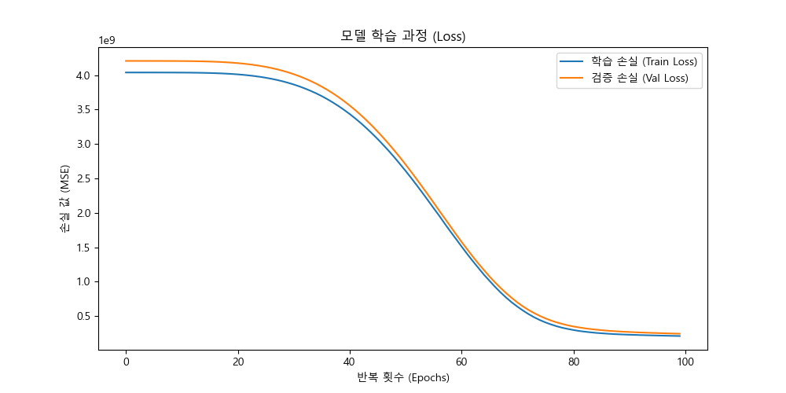

# 🏠 우리 집 근처 부동산 가격 예측 프로젝트

이 프로젝트는 텐서플로와 제미나이를 활용하여 실거래가를 예측하고 분석합니다.

## 🚀 프로젝트 주요 단계 및 기술 스택

### 1. 환경 설정 및 데이터 수집
* **주요 작업**: 라이브러리 설치 및 공공데이터 API 연동 (금천구 2024년 6개월치 데이터 확보)
* **보안 관리**: API 키 노출 방지를 위해 `.env` 파일과 `.gitignore` 활용
* **Technical Stack**: `Python`, `Requests`, `python-dotenv`

### 2. 데이터 전처리 및 시각화 (EDA)
* **주요 작업**: 거래금액 정수형 변환, 결측치 제거, '아파트 나이' 변수 생성 및 상관관계 분석
* **Technical Stack**: `Pandas`, `Matplotlib`, `Seaborn`

#### 📊 시각화 분석 결과
| 동네별 평균 거래가 | 전용면적과 거래금액의 상관관계 | 아파트 나이에 따른 가격 분포 |
| :---: | :---: | :---: |
|  |  |  |

### 3. 텐서플로 모델링
* **주요 작업**: 특징(X)과 정답(y) 분리, 법정동 원-핫 인코딩, 데이터 스케일링 및 신경망 모델 학습
* **Technical Stack**: `TensorFlow`, `Keras`, `NumPy`, `Scikit-learn`

#### 📊 학습 결과 시각화
| 모델 학습 과정 (Loss) |
| :---: |
|  |
| **반복 학습(Epochs)에 따른 학습 및 검증 손실 값의 변화** |

---

### 4. Gemini 연동
* **주요 작업**: 모델의 예측 결과에 대해 AI의 자연어 해석 및 맞춤형 부동산 리포트 자동 생성
* **Technical Stack**: `Google Generative AI (Gemini API)`, `python-dotenv`

#### 📊 예측 시뮬레이션 및 AI 리포트 결과
| AI 예측 실행 화면 (Input) | Gemini 전문가 분석 리포트 (Output) |
| :---: | :--- |
|  |  |
| **사용자 조건 기반 예측 결과** | **AI 전문가의 상세 분석 및 조언** |

#### 📊 예측 시뮬레이션 및 AI 리포트 결과

| AI 예측 실행 화면 (Input) | Gemini 전문가 분석 리포트 (Output) |
| :---: | :--- |
|  |  |

---

### 5. 시각화 및 최종 정리
* **주요 작업**: 학습 결과 그래프 시각화, 코드 모듈화(gemini_analysis.py 분리) 및 최종 문서화
* **Technical Stack**: `Matplotlib`, `Markdown`

---

## ⚙️ 핵심 로직 (Core Logic)
1. **data_collector.py**: API 호출 및 XML 데이터를 파이썬 딕셔너리로 변환하는 로직 모듈화
2. **main.py**: 6개월치 데이터 반복 수집 및 학습 가능한 수치 형태로 정제하여 CSV 저장
3. **visualize.py**: CSV 데이터를 불러와 통계적 특성 분석 및 주요 특성(Feature) 시각화 확인
4. **gemini_analysis.py**: 예측값과 사용자 조건을 받아 Gemini 2.5 모델을 통해 분석 리포트를 생성하는 독립 모듈
5. **model_training.py**: 텐서플로 신경망 학습 및 사용자 인터페이스(입력창)를 통한 최종 통합 실행 로직

---

## 🤝 마무리하며
본 프로젝트는 **딥러닝을 통한 수치적 예측**과 **거대언어모델(LLM)을 통한 논리적 분석**을 결합한 사례입니다. 단순 가격 제시를 넘어 사용자에게 데이터 기반의 설득력 있는 리포트를 제공하는 데 목적이 있습니다.

